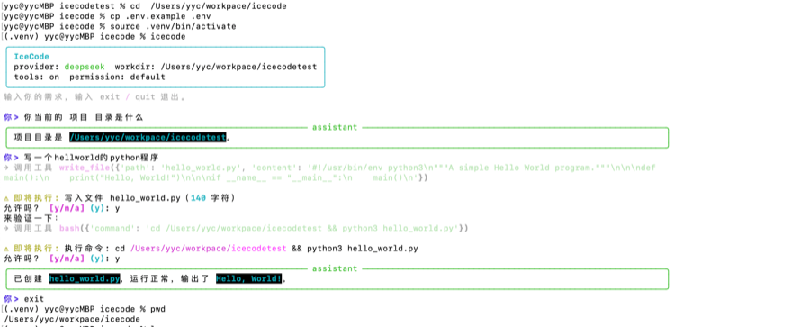

# IceCode

Python CLI Agent：多轮对话 + 工具调用（读/写/搜文件、执行 shell），支持 DeepSeek / Anthropic，带权限确认。

设计上对齐常见 coding agent 的循环（LLM → tool_use → tool_result → 再决策），协议采用 Anthropic 风格 content-block，便于换模型。

<p align="center">
  
</p>

## 能力

- **Agent Loop**：模型决策 → 执行工具 → 把结果回灌，直到任务完成或达轮次上限
- **工具**：`read_file` / `write_file` / `edit_file` / `bash` / `glob_search` / `grep_search`
- **权限**：副作用操作需确认；`PERMISSION_MODE` 支持 `default` / `accept_edits` / `dont_ask`
- **安全**：工具 fail-closed；文件操作限制在 `WORKDIR` 内；bash 危险命令黑名单
- **多 Provider**：DeepSeek（默认）与 Anthropic，可在 factory 中扩展

## 快速开始

```bash
cp .env.example .env
# 编辑 .env，填入 DEEPSEEK_API_KEY

pip install -e .
icecode
# 或
python -m icecode
```

纯对话（关闭工具）：

```bash
ICECODE_ENABLE_TOOLS=false icecode
```

## 结构

```
icecode/
  cli.py           # REPL 入口
  agent.py         # Agent Loop
  config.py        # 环境配置
  permissions.py   # 权限确认与模式
  llm/             # Provider 抽象 + DeepSeek / Anthropic
  tools/           # 工具基类、注册表与具体工具
```

## 环境变量（摘要）

| 变量 | 说明 |
|------|------|
| `DEEPSEEK_API_KEY` | DeepSeek API Key（默认 Provider） |
| `WORKDIR` | 工具沙箱根目录，默认当前目录 |
| `ICECODE_ENABLE_TOOLS` | `false` 时仅对话 |
| `PERMISSION_MODE` | `default` / `accept_edits` / `dont_ask` |
| `AUTO_APPROVE` | `true` 跳过全部确认（慎用） |
